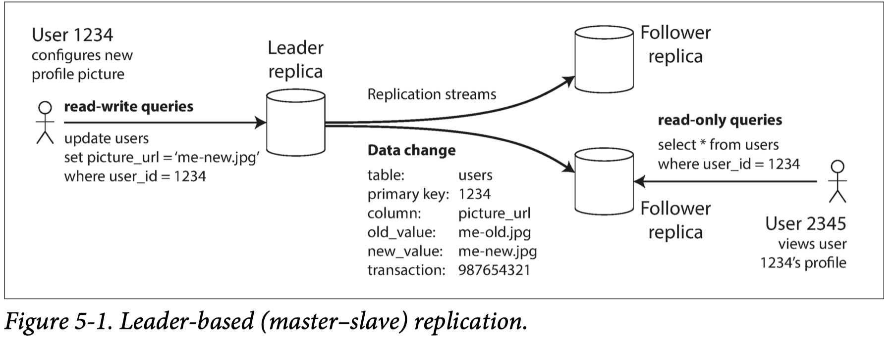
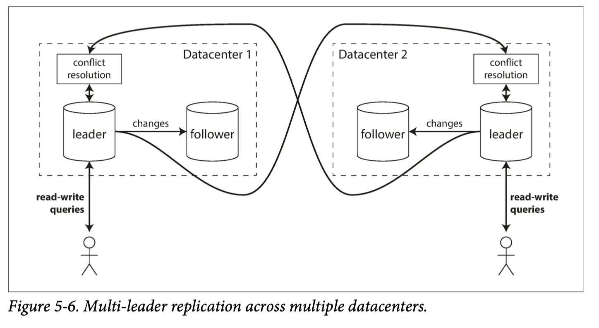

This blog is my reading notes for _Designing Data-Intensive Applications_, Chapter 05: Replication.

## Overview

`Replication` means keeping a copy of the **same data** on multiple machines that are connected via a network. It has following benefits:

* **High availability**: Keeping the system running, even when one/several machines goes down
* **Latency**: Placing data geographically close to users, so that users can interact with it faster
* **Scalability**: Being able to handle a higher volume of **reads** than a single machine could handle, by performing reads on replicas

However, keeping data consistent between replicas are not as simple as it looks. We need to consider the following issues: node failures; unreliable networks; and tradeoffs around replica consistency, durability, availability, and latency. Let's look at them one by one:

* should we use synchronous or asynchronous?
* which granularity of Replication Logs should we use?
* which kind of replication architecture: Single-leader, multiple-leader, or leaderless?
* should we provide consistency stronger than eventual consistency?
* How to handle node failure and unreliable network?
* How to handle concurrency write conflicts?

## Synchronous vs Asynchronous

* `synchronous`: the leader waits until follower has confirmed that it received the write before reporting success to the user, and before making the write visible to other clients.
* `asynchronous`: the leader sends the message, but doesn’t wait for a response from the follower.
* `semi-synchronous`: one of the followers is synchronous, and the others are asynchronous. If the synchronous follower becomes unavailable or slow, one of the asynchronous followers is made synchronous. In practice, if you enable synchronous replication on a database, it usually means semi-synchronous.

`Synchronous` is impractical because the leader must block all writes and wait until the synchronous replica is available again. **Often, leader-based replication is configured to be completely asynchronous**. In this case, if the leader fails and is not recoverable, any writes that have not yet been replicated to followers are lost. This means that a write is not guaranteed to be durable, even if it has been confirmed to the client. However, a fully asynchronous configuration has the advantage that the leader can continue processing writes, even if all of its followers have fallen behind.

## Granularity of Replication Logs

* `Statement-based` replication: Deprecated. In the simplest case, the leader logs every write request (statement) that it executes and sends that statement log to its followers. For a relational database, this means that every INSERT, UPDATE, or DELETE statement is forwarded to followers, and each follower parses and executes that SQL statement as if it had been received from a client. Statements may be nondeterministic or have side effects, which causes replications diverge.

* `Write-ahead log` (WAL) shipping: the log is an append-only sequence of bytes containing all writes to the database. We can use the exact same log to build a replica on another node. The disadvantage is that it makes replication closely coupled to the storage engine. A newer software version usually had format compatibility issue, which requires downtime for upgrading.

* `Logical (row-based)` log replication: A logical log for a relational database is usually a sequence of records describing writes to database tables at the granularity of a row.

## Replication architectures

There are three main approaches to replication and each approach has advantages and disadvantages. Single-leader replication is popular because it is fairly easy to understand and there is no conflict resolution to worry about. Multi-leader and leaderless replication can be more robust in the presence of faulty nodes, network interruptions, and latency spikes—at the cost of being harder to reason about and providing only very weak consistency guarantees.

### Single-leader replication

1. One of the replicas is designated the leader. Write requests of clients can only go to leader, which first writes the new data to its local storage.
2. The other replicas are known as followers . Whenever the leader writes new data to its local storage, it also sends the data change to all of its followers. Each follower takes the log from the leader and updates its local copy of the database accordingly.
3. When a client wants to read from the database, it can query either the leader or any of the followers. However, writes are only accepted on the leader.

### Multi-leader replication

Clients send each write to one of several leader nodes, any of which can accept writes. The leaders send streams of data change events to each other and to any follower nodes.

Multi-leader replication has advantage on performance, tolerance of datacenter outages, tolerance of network problems.
However, it rarely makes sense to use a multi-leader setup within a single datacenter, because the benefits rarely outweigh the added complexity: the same data may be concurrently modified in two different datacenters, and those write conflicts must be resolved.

Here are some common use cases for multi-leader replication:

* Multi-datacenter operation: Within each datacenter, regular leader-follower replication is used; between datacenters, each datacenter’s leader replicates its changes to the leaders in other datacenters.
* Clients with offline operation: you have an application that needs to continue to work with multiple devices while they are disconnected from the internet.In this case, every device has a local database that acts as a leader (it accepts write requests), and there is an asynchronous multi-leader replication process (sync) between the replicas on all of your devices.
* Collaborative editing: When one user edits a document, the changes are instantly applied to their local replica (the state of the document ) and asynchronously replicated to the server and any other users who are editing the same document.

### Leaderless replication

Also called Dynamo-style: allow any replica to directly accept writes from clients. In some leaderless implementations, the client directly sends its writes to several replicas, while in others, a coordinator node does this on behalf of the client. However, unlike a leader database, that coordinator **does not enforce a particular ordering of writes**. Version numbers are used to determine which value is newer.

`quorum reads and writes` tries to solve the issue of reading stale data: if there are n replicas, every write must be confirmed by w nodes(synchronized) to be considered successful, and we must query at least r nodes for each read. As long as there is an **overlap**, that is, w + r > n, we expect to get an up-to-date value when reading. With a smaller w and r you are more likely to read stale values, but this configuration allows lower latency and higher availability.

However, even with w + r > n, there are likely to be edge cases where stale values are returned, e.g., sloppy quorum, two writes occur concurrently, a write happens concurrently. Thus, **Dynamo-style databases are generally optimized for use cases that can tolerate eventual consistency**.

How to ensure that eventually all the data is copied to every replica? There are two ways:

* **Read repair**: When a client makes a read from several nodes in parallel, it can detect any stale responses. The client then writes the newer value back to the replica that has stale data.
This approach works well for values that are frequently read. However, values that are rarely read may be missing from some replicas and thus have reduced durability.

* **Anti-entropy process**: a background process that constantly looks for differences in the data between replicas and copies any missing data from one replica to another. Unlike the replication log in leader-based replication, this anti-entropy process does not copy writes in any particular order, and there may be a significant delay before data is copied.

## Node Failures

If a follower fails, we can use the `Catch-up` strategy. On its local disk, each follower keeps a log of the data changes it has received from the leader. If a follower crashes and is restarted, or if the network recovers from a temporary failure, it can connect to the leader and request all the data changes that occurred during the time when the follower was disconnected. When it has applied these changes, it has caught up to the leader and can continue receiving a stream of data changes as before.

If a leader fails, we can use the `Failover` strategy: one of the followers needs to be promoted to be the new leader, clients need to be reconfigured to send their writes to the new leader, and the other followers need to start consuming data changes from the new leader.

An automatic failover process usually consists of the following steps:

1. Determining that the leader has failed. There is no foolproof way of detecting if a node is crashed or disconnected from the network, so most systems simply use a **timeout**: nodes frequently bounce heartbeat message back and forth between each other, and if a node doesn’t respond for some period of time, it is assumed to be dead.

2. Choosing a new leader. This could be done through an election process, or a new leader could be appointed by a previously elected controller node. The best candidate for leadership is usually the replica with the most up-to-date data changes from the old leader.

3. Reconfiguring the system to use the new leader. Clients now need to send their write requests to the new leader. The system needs to ensure that the old leader becomes a follower and recognizes the new leader, if the old leader comes back.

## Challenges with Replication Lag

In an asynchronous architecture, client may see outdated information if the replica has fallen behind. If you stop writing to the database and wait a while, replicas will eventually catch up and become consistent with each other, which is known as `eventual consistency`.

When working with an eventually consistent system, it is worth thinking about how the application behaves if the replication lag increases to several minutes or even hours. If the answer is “no problem,” that’s great. However, if the result is a bad experience for users, it’s important to design the system to provide a stronger guarantee.

### Reading Your Own Writes

When new data is submitted, it must be sent to the leader, but when the user views the data, it can be read from a follower. the new data may not yet have reached the replica. To the user, it looks as though the data they submitted was lost

`read-after-write consistency`: This is a guarantee that if the user reloads the page, they will always see any updates they submitted themselves. It makes no promises about other users: other users’ updates may not be visible until some later time.

Implementations in leader-based architecture:

* If only a few things in the application are potentially editable by the user, when reading something that the user may have modified, read it from the leader; otherwise, read it from a follower
* Use criteria to decide whether to read from the leader, i.e, for one minute after the last update, make all reads from the leader
* The client can remember the timestamp of its most recent write. If a replica is not sufficiently up to date, query another replica or wait until the replica has caught up.

### Monotonic Reads

When reading from asynchronous followers is that it’s possible for a user to see things moving backward in time because of reading an out-of-date replica.

`Monotonic reads`: if one user makes several reads in sequence, they will not read older data after having previously read newer data.

Implementation: each user always makes their reads from the same replica, i.e., the replica can be chosen based on a hash of the user ID.

### Consistent Prefix Reads

`consistent prefix reads`: if a sequence of writes happens in a certain order, then anyone reading those writes will see them appear in the same order.

One implementation is to make sure that any writes that are causally related to each other are written to the same partition.

## Concurrency Write Conflicts

Concurrency Write issues are inherent in multi-leader and leaderless replication approaches: because they allow multiple writes to happen concurrently, conflicts may occur.

### Conflict avoidance

If the application can ensure that all writes for a particular record go through the same leader, then conflicts cannot occur, i.e, route user write requests to the same leader based on the hash of its user id.

### Converging toward a consistent state

Approaches that are dangerously prone to data loss:

* Give each **write** a unique ID (e.g., a timestamp, a long random number, a UUID, or a hash of the key and value), pick the write with the highest ID as the winner, and throw away the other writes. If a timestamp is used, this technique is known as `last write wins (LWW)`
* Give each replica a unique ID, and let writes that originated at a higher numbered replica always take precedence over writes that originated at a lower numbered replica.

There are some situations, such as caching, in which lost writes are perhaps acceptable. If losing data is not acceptable, LWW is a poor choice for conflict resolution. The only safe way of using a database with LWW is to ensure that a key is only written once and thereafter treated as immutable, thus avoiding any concurrent updates to the same key. For example, a recommended way of using Cassandra is to use a UUID as the key, thus giving each write operation a unique key
  
Other approaches are:

* merge the values together, e.g., order them alphabetically and then concatenate them
* Record the conflict in an explicit data structure that preserves all information, and write application code that resolves the conflict at some later time (perhaps by prompting the user).

## Reference

> [1] _Designing Data-Intensive Applications_, Chapter 05: Replication
